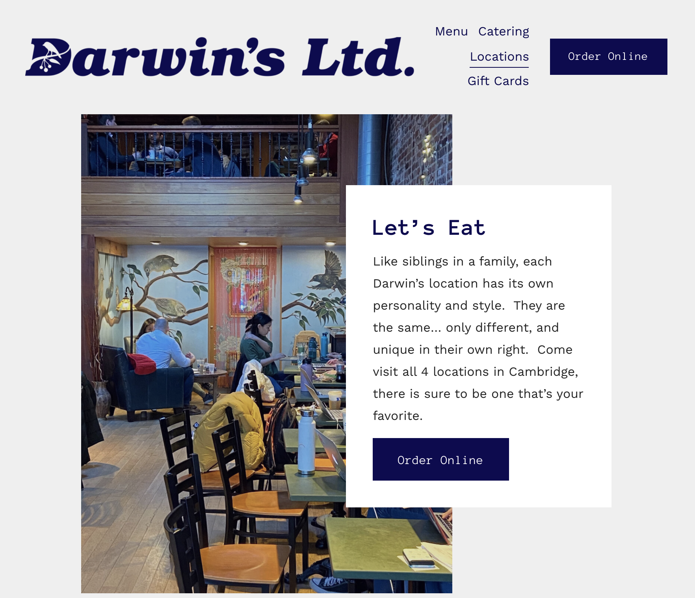

Unbashedly including on the Internet that I am the star of Darwin's locations page, sitting in that green top and with awful posture. You can appreciate the experience in its full glory <a href="https://www.darwinsltd.com/locations?fbclid=IwAR2ngD6B6wCAzdIZ_0PRe8hEwrjVOQjURuL7K-lPxvZsCNmbssmcHfq3oso">here</a>.

I love Darwin's – for those of you unfamiliar with Darwin's, it's a local café with absolutely delicious sandwiches. They have four locations in Cambridge, but I'm always at the Mass Avenue spot because of its proximity to MIT. I'm a _big_ fan of the Mt Auburn with Rosemary Garlic bread; this sandwich has been with me through a lot. I distinctly remember eating this sandwich with a can of Calpico and some green grapes after I quit my architecture program last summer and thinking to myself "What did I just do?" Perhaps that moment was more significant than how delicious this sandwich is, but that's a story for another blog post!
