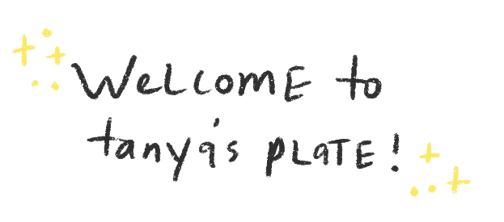

I made a newsletter! 🥳 You can check out its archives in the handy dandy Newsletter tab of this website, and that's also where you can subscribe.

I've coined the name "Tanya's Plate" because this newsletter is a reflection of what I've been enjoying, consuming, percolating on, and it's food for thought I want to share. I love linking interesting (and occasionally goofy) articles on my social media accounts, and I thought – why not wrap this up as a little present for those who are interested to open in their mailboxes? Can you tell that I enjoy getting emails?

I noticed after my first year at MIT that my ability to think critically was not developing as quickly as my other skills (i.e. coding). I took it upon myself to rediscover my love for reading the summer after first year, and I ended up blazing through a huge number of books. Let me tell you – it was a fruitful summer. It was so comfortable settling back into a core component of my identity that had been stunted by a year of technical courses. For the MIT college essay asking what you like to do for fun, I proudly wrote about my love for reading.

> _Reading is so precious to me. I try to take whatever sliver of time I have between my daily activities to open my book and indulge in the cornucopia of knowledge until I am totally satiated. Although many prefer e-books, I love the weight of a book on the palm of my hand. More often than not, my books are dog-eared and decorated with soup and tea stains, but whenever I flip a page, I feel as though I’ve grown an inch._

Lately, as we've all been stuck at home and find ourselves with a few extra hours in the day, I've re-rediscovered my love for reading once again! However, I've noticed that my interests have shifted drastically from fiction to a hodgepodge of nonfiction, from memoirs to cultural critiques. I'm having trouble enjoying fiction as much as I used to, and this admittedly has been a little jarring. However, rather than force myself to complete another novel, I'm accepting that it's okay to change tastes and read something a little different. As I prepare to enter my second half of my undergraduate education, I'm taking the action to answer the big questions I've always had and that won't be resolved by advanced coursework in computer science. This newsletter, a bi-weekly monster that I churn out and miss the occasional typo, is a reflection of answering those questions.

It's also a reflection of my personal philosophy. I actively reminisce about my childhood and the innocent wonder I approached the world with, and I'm trying to take a beat to simply enjoy things, whether it be a goofy cartoon or a string of words that just elegantly ring true. I'm a camp counselor for the MIT Camp Kesem chapter – in other words, I spend a week before every fall semester of college running around and throwing oatmeal and holding hands and listening to the dreams of children whose parents have cancer. In contributing to the opportunity for these kids to have a week to be a kid, away from the complexities of their parents' illnesses, I've confirmed that all of us are just big kids trying our best to navigate this world, to communicate with each other, to understand issues that don't seem quite clear, to get some good giggles. With this newsletter, I hope to share a little slice of the magical energy we've all stored away as we face the "real" world.

Thanks for reading – see you next time!
